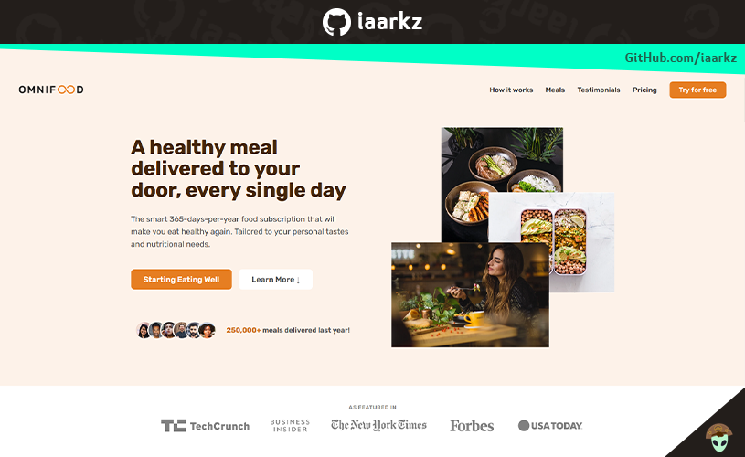
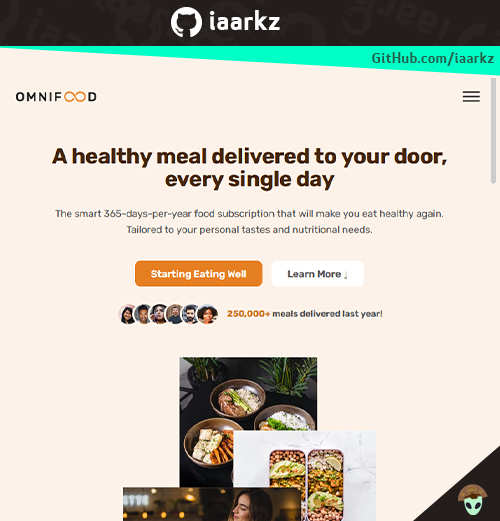
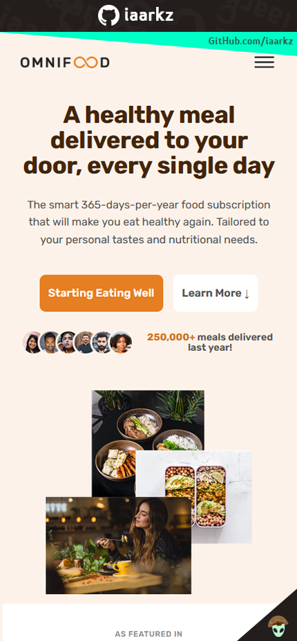

# Omnifood Project

&nbsp;

### This is a simple mock-up one-page website for food services featuring the ficticious Omnifood brand. The Omnifood project it's a responsive website, working on multiple platforms (Computer, Phones and Tablets). This project is mainly build only with HTML, CSS and a bit of JavaScript.

&nbsp;
&nbsp;
## 
Responsive Design Tablet Mode

&nbsp;
&nbsp;

## 
Responsive Design Phone Mode

